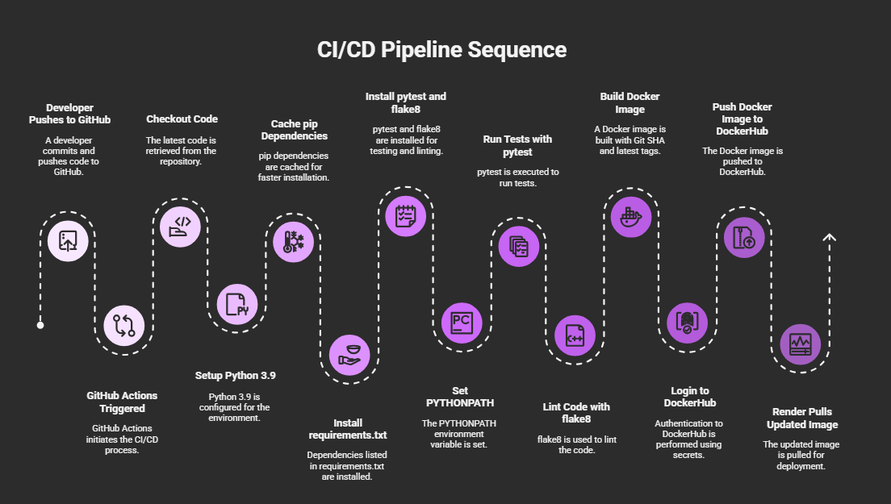

# NatureVigil
## Technology Meets Conservation

### Overview

NatureVigil is an innovative biodiversity conservation initiative that leverages machine learning models and community engagement to protect ecosystems. By integrating AI-driven monitoring tools with a gamified platform, we empower individuals to contribute meaningfully to environmental sustainability.

### Features

#### AI-Powered Monitoring Tools

- **Species Classifier**: Identifies endangered species from images to combat poaching and habitat loss.
- **Forest Health Predictor**: Analyzes factors like tribal population growth and industrial expansion to forecast deforestation hotspots over time.
- **Extinction Risk Analyzer**: Predicts survival odds for wildlife using factors like invasive species and human encroachment.
- **Aquatic Ecosystem Monitor**: Tracks water health (pH, temperature, pollutants) to safeguard marine life.

#### Eco-Connect: The People’s Movement

- **Gamified Platform**: Students and colleges earn *Green Coins* for eco-friendly actions like planting trees or adopting solar energy.
- **Academic Rewards**: Redeem coins for academic credits or rank on leaderboards—making sustainability a shared mission.
- **Global Biodiversity Insights**: Share stories, track global biodiversity metrics, and learn through interactive maps.

### Use Cases

- **Researchers**: Access real-time species data and predictive analytics.
- **Students**: Turn eco-actions into academic rewards.
- **Policymakers**: Utilize precision tools to enforce conservation laws.

### Getting Started

1. **Clone the Repository**:
git clone https://github.com/yourusername/NatureVigil.git

text

2. **Install Dependencies**:
pip install -r requirements.txt

text

3. **Run the Application**:
python app.py

text

## CI/CD Pipeline

This project uses a professional CI/CD pipeline powered by GitHub Actions.

- **Automatic Testing:** All backend models are tested using `pytest` on every push and pull request.
- **Linting:** Code style is checked with `flake8`.
- **Docker Build & Push:** If tests pass, a Docker image is built and pushed to DockerHub automatically.

### How it Works

1. **Code Checkout:** The workflow checks out the latest code.
2. **Dependency Installation:** Installs all Python dependencies.
3. **Testing:** Runs all backend tests in the `tests/` directory.
4. **Linting:** Checks code style with `flake8`.
5. **Docker Build:** Builds a Docker image for the backend.
6. **DockerHub Push:** Pushes the image to DockerHub for deployment.

This ensures that every change is tested, linted, and ready to deploy with no manual steps.

---

*For more details, see the workflow file in `.github/workflows/fullstack-ci.yml`.*

### License

Distributed under the MIT License. See `LICENSE` for more information.

### Contact

Your Name - [your@email.com](mailto:your@email.com)

Project Link: [https://github.com/yourusername/NatureVigil](https://github.com/yourusername/NatureVigil)
